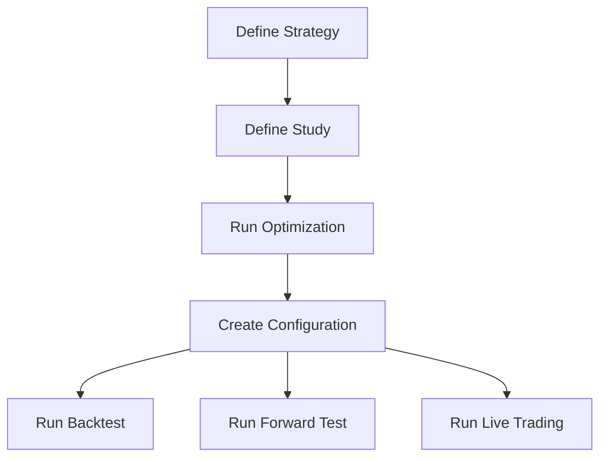

# Modular Trading System Architecture

This document outlines a modular architecture for the trading system. The goal is to allow for easy configuration and execution of different studies, strategies, and parameters across all execution modes (live, backtest, forward test, and optimization).

## Core Components

### 1. Configuration Files

- **`studies/{study_name}.json`**: Defines the parameters for an Optuna study. This includes the parameter space, the objective function, and the number of trials.
- **`strategies/{strategy_name}.py`**: Implements the trading strategy logic. Each strategy will have a common interface for signal generation and exit logic.
- **`configs/{config_name}.json`**: A configuration file that ties together a study, a strategy, and a set of parameters. This file will be used to configure the execution modes.

### 2. Execution Modes

- **`run.py`**: A single entry point for all execution modes. It will take the configuration file as an argument and execute the specified mode.
- **`live/`**: The live trading engine.
- **`backtest/`**: The backtesting engine.
- **`forward_test/`**: The forward testing engine.
- **`optimize/`**: The Optuna optimization engine.

## Workflow

1.  **Define a Strategy**: Create a new strategy file in the `strategies/` directory.
2.  **Define a Study**: Create a new study file in the `studies/` directory to define the parameter space for the strategy.
3.  **Run Optimization**: Use `run.py` with the `optimize` mode to run an Optuna study and find the best parameters for the strategy.
4.  **Create a Configuration**: Create a new configuration file in the `configs/` directory that specifies the strategy, the best parameters, and other settings.
5.  **Run Backtest/Forward Test**: Use `run.py` with the `backtest` or `forward_test` mode to evaluate the performance of the strategy with the selected parameters.
6.  **Run Live Trading**: Use `run.py` with the `live` mode to trade the strategy in the live market.

## Mermaid Diagram

