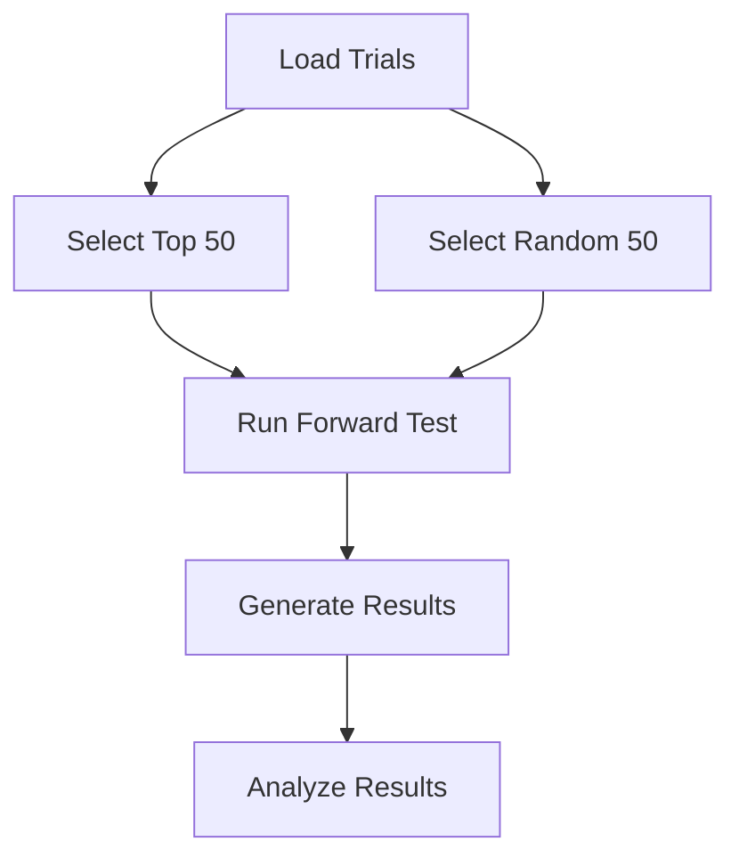

# Plan for Wide Forward Test

This plan outlines the steps to run a wide forward test on the top 50 trials and 50 random trials from the `gl_trail_v3` study for the out-of-sample period starting from March 2026.

## 1. Create a New Forward Test Script

We will create a new script named `run_wide_forward_test.py` that will be responsible for:

- Loading the top 50 and 50 random trials from the `gl_trail_v3` study.
- Running the forward test for the specified out-of-sample window (March 2026 onwards).
- Generating a summary of the results.

## 2. Modify Parameter Loading and Selection

We will modify the parameter loading and selection logic to:

- Load the best parameters from the `gl_trail_v3` study.
- Select the top 50 trials based on their training score.
- Randomly select 50 trials from the remaining completed trials.

## 3. Enhance Backtesting Engine

We will enhance the backtesting engine to:

- Support the new out-of-sample window (March 2026 onwards).
- Incorporate any necessary changes to the simulation logic.
- Improve the reporting of results.

## 4. Implement New Data Loading Mechanism

We will implement a new data loading mechanism to:

- Load the data for the 2026 out-of-sample window.
- Ensure that the data is correctly formatted and aligned with the backtesting engine.

## 5. Align with Live Execution Engine

We will review the live execution engine and ensure that the forward testing process is aligned with the live trading environment.

